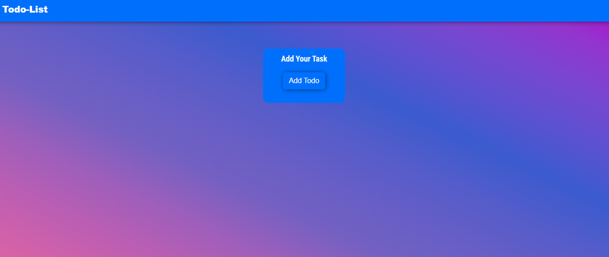
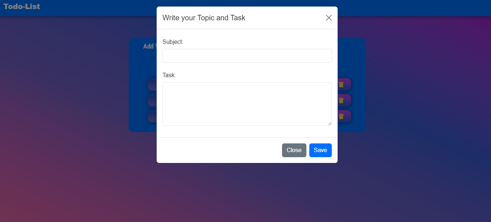
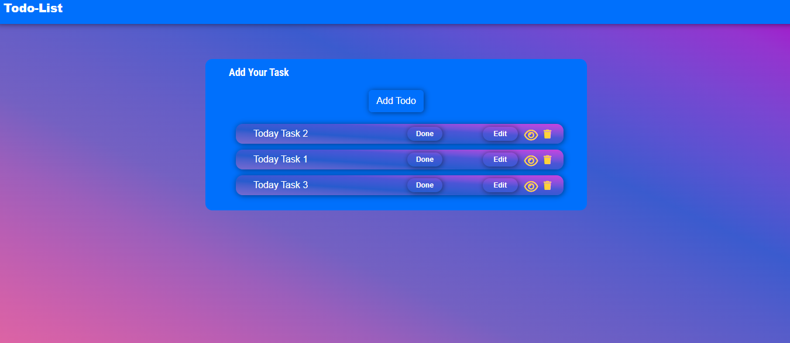
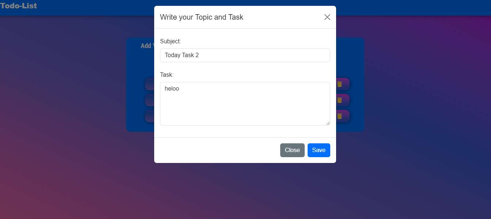
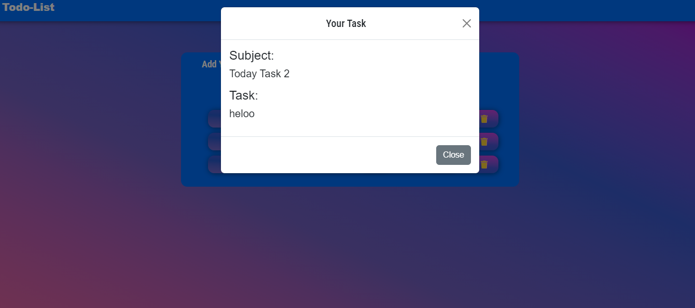
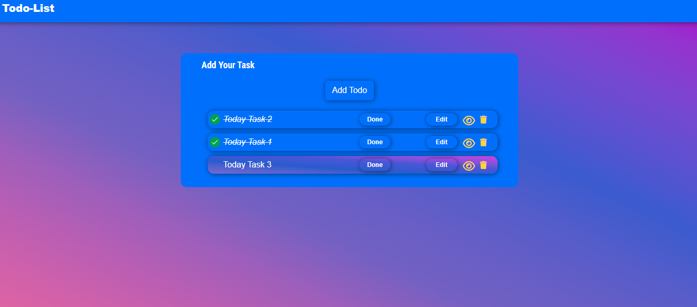

# 📋 TaskMaster - To-Do List App

## Introduction

Welcome to **TaskMaster**, your ultimate companion for managing tasks and boosting productivity! This beautifully crafted to-do list application is built using HTML, CSS, and JavaScript and Firebase designed to make task management effortless and enjoyable across all devices.

## Features

- **User-Friendly Interface:** A clean and intuitive design that makes task management a breeze.
- **Responsive Design:** Enjoy seamless functionality on desktops, tablets, and smartphones.
- **Task Management:** Easily create, update, and delete tasks with a few clicks.
- **Organized Layout:** View and prioritize tasks with filters and sorting options.
- **Performance Optimized:** Fast load times and smooth interactions.

## Demo

Experience TaskMaster in action: [Live Demo](https://your-github-username.github.io/taskmaster/)

## How to Use

1. **Create a Task**  
   Click on the "Add Task" button, enter your topic and tasks,.

2. **View Your Tasks**  
   Click on eye button where you can see your task.

3. **Update Tasks**  
   Click on any task to edit its details . You can also drag and drop to reorder tasks.

4. **Complete and Delete**  
   Mark tasks as complete by checking them off or delete them when no longer needed using the delete icon.

## Screenshots

## Technologies Used

- **HTML5:** For structuring the app content.
- **CSS3:** For styling and responsive design.
- **JavaScript:** For task management logic and interactivity.
- **Firebase:** For Database where i used Firestore.

## Acknowledgements

- Inspired by the need for an elegant and effective task management solution.
- Thanks to the open-source community and various libraries that helped make this project a reality.

---

⭐️ If you like TaskMaster, please give it a star on GitHub!
